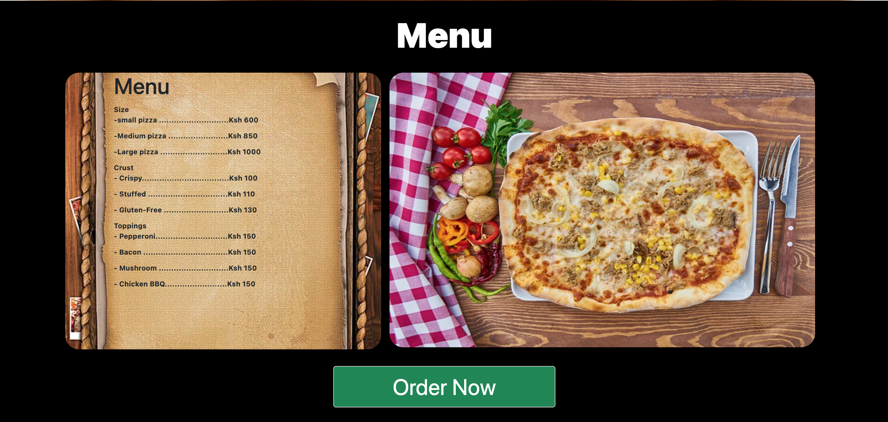
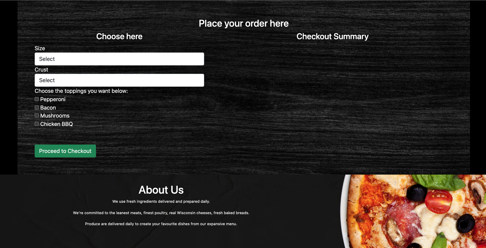
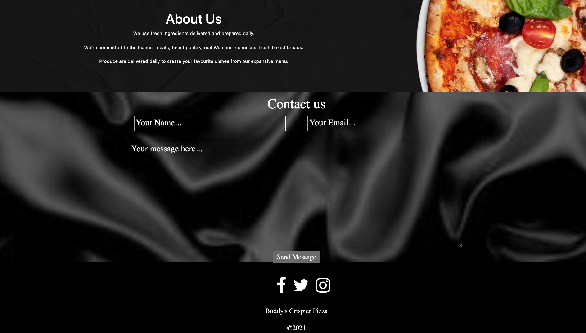

# Buddy's Crispier Pizza
<a href="https://cosbett.github.io/Buddy-s-Crispier-Pizza/" > Live Demo link</a>
####
A web application for Pizza Restaurant to  widen customer base coverage with great features to improve client satisfaction and service delivery.
Latest version - 29th Nov 2021
#### By **Cosmas Bett**
## Description

This project is a web application for fictional Pizza house which enables customers to choose the size, crust and  topping of pizza depending on their preference and able to place the order and decide if they would like home delivery  or pick it from the shop. The application have a form for customer to fill in contact information, name, phone number and place if they would like a delivery.

### How to Clone this application,
 1. Open the terminal
 2. Paste this <strong> git clone https://github.com/CosBett/Buddy-s-Crispier-Pizza </strong>
3. Open and edit with a code editor of your preference.

### Usage Instruction,
1. Open your browser (preferably google chrome and active internet connection is required.) and paste the link below;
https://cosbett.github.io/Buddy-s-Crispier-Pizza/ or <a href="https://cosbett.github.io/Buddy-s-Crispier-Pizza/" > Click here</a> to acess. 
2. Depending on what you want to order,click on "order now" button on landing page to direct you to where you can place the order.
3. Depending on your needs you can choose the size, crest and toppings to be added to your pizza.
4. Click "proceed "button to get the checkout summary.
5. Click the "home delivery"memthod if you want to be delivered, confirm and checkout for order to be placed.

### Installation
This is a web application and there is no need to worry about installing it . There is no other code this app depends on.

## Known Bugs
No Known bugs at the moment.

## Technologies Used
1. HTML.
2. Boostrap 5.1.3 -for framework and overall web page responsiveness.
3. Javascript - For Bussiness logic interface.
4. JQuery - Give the page contents a good UI/UX 
5. CSS  

## Support and contact details

Incase of any issues or clarification, development, ideas, concerns or contributions to the code.  Kindly reach out through my email cosmasbett9@gmail.com.
### License

* Copyright 2021 Cosmas Bett

Permission is hereby granted, free of charge, to any person obtaining a copy of this software and associated documentation files (the "Software"), to deal in the Software without restriction, including without limitation the rights to use, copy, modify, merge, publish, distribute, sublicense, and/or sell copies of the Software, and to permit persons to whom the Software is furnished to do so, subject to the following conditions:
The above copyright notice and this permission notice shall be included in all copies or substantial portions of the Software.
THE SOFTWARE IS PROVIDED "AS IS", WITHOUT WARRANTY OF ANY KIND, EXPRESS OR IMPLIED, INCLUDING BUT NOT LIMITED TO THE WARRANTIES OF MERCHANTABILITY, FITNESS FOR A PARTICULAR PURPOSE AND NONINFRINGEMENT. IN NO EVENT SHALL THE AUTHORS OR COPYRIGHT HOLDERS BE LIABLE FOR ANY CLAIM, DAMAGES OR OTHER LIABILITY, WHETHER IN AN ACTION OF CONTRACT, TORT OR OTHERWISE, ARISING FROM, OUT OF OR IN CONNECTION WITH THE SOFTWARE OR THE USE OR OTHER DEALINGS IN THE SOFTWARE.
*
Copyright (c) 2021 **Cosmas Bett**
  